# 🚀 No-Code MCP Generator

> **Turn any OpenAPI Spec into an AI Agent Server in seconds.**  
> Enterprise-grade, secure, and ready for the Model Context Protocol (MCP).


The **No-Code MCP Generator** is a developer platform that bridges the gap between your existing APIs (OpenAPI/Swagger) and modern AI Agents like Claude Desktop. It generates fully typed, secure, and production-ready **MCP Servers** effectively "teaching" AI agents how to use your tools without writing a single line of code.

---

## ✨ Key Features

### 🏗️ Architecture & Core
-   **Instant Generation**: Upload `openapi.json`, get a downloadable TypeScript project.
-   **Type-Safe**: Auto-generates Zod schemas and TypeScript interfaces from your spec.
-   **Modern UI**: Beautiful "bento-grid" dashboard built with **Next.js 14** and **Tailwind CSS**.

### 🛡️ Enterprise Security Suite
-   **"The Shovel" (Auth Injection)**: Automatically detects `securitySchemes` and injects dynamic API Key handling (`/secrets` endpoint). No hardcoded credentials.
-   **"Safety Valve" (Rate Limiting)**: Built-in middleware limits destructive actions (POST/DELETE) to prevent AI loops from causing mass damage.
-   **Audit Ready**: generated code follows strict linting and safety standards.

### ☁️ Hybrid Cloud "Tunnel Bridge"
-   **Privacy First**: Your data stays local. The generator runs locally or in your private cloud.
-   **Tunnel Agent**: Includes a `start-tunnel.sh` script that auto-provisions a **Secure Cloudflare Tunnel**, allowing you to control your local agent from a hosted dashboard without exposing ports.

---

## 🛠️ Architecture

```mermaid
graph TD
    User[👩‍💻 User] -->|Upload OpenAPI Spec| UI[Frontend UI]
    UI -->|POST /upload| Backend[Generator Backend]
    subgraph "Generation Engine"
        Backend -->Parser[OpenAPI Parser]
        Parser -->ToolGen[Tool Generator]
        ToolGen -->|Inject Auth & Limits| CodeGen[Code Synthesis]
        CodeGen -->|Zip| Output[Generated Project]
    end
    Output -->|Download| User
    
    subgraph "Runtime (Hybrid)"
        Agent[Generated MCP Server]
        Tunnel[Cloudflare Tunnel]
        Cloud[Cloud Dashboard]
        
        Agent <-->|Secure Pipe| Tunnel
        Tunnel <-->|HTTPS| Cloud
    end
```



---

## 🚀 Getting Started

### For End Users (Generating a Server)

1.  **Run the Generator**:
    ```bash
    npm run dev:all # Starts both Frontend (3000) and Backend (3001)
    ```
2.  **Upload Specification**:
    -   Navigate to `http://localhost:3000`.
    -   Drag & Drop your `openapi.json` (or use our provided `test-openai.json`).
3.  **Download & Deploy**:
    -   Click "Generate Agent Server".
    -   Download the valid TypeScript project.

### For Developers (Contributing)

**Prerequisites**: Node.js v20+, npm.

1.  **Clone the Repository**:
    ```bash
    git clone https://github.com/noogler-aditya/no-code-mcp-generator.git
    cd no-code-mcp-generator
    ```

2.  **Install Dependencies**:
    ```bash
    # Root level install (script setup)
    npm install
    
    # Install specific workspace deps
    cd frontend && npm install
    cd ../backend && npm install
    ```

3.  **Development Mode**:
    We provide a convenience script to run both services:
    ```bash
    # From root
    npm run dev:all
    ```

---

## 📦 usage of Generated Server

Once you download your project, here is how to use it:

### 1. Local Mode (Claude Desktop)
Run directly on your machine using stdio.
```bash
cd my-generated-server
npm run setup:claude
```
This installs dependencies, builds, and configures Claude Desktop with **absolute paths**.  
Restart Claude Desktop after running.

> ⚠️ Tunnel URLs do **not** work with Claude Desktop. Use Local Mode (stdio).

### 2. Hybrid Tunnel Mode (Enterprise)
Expose your local server securely to a managed cloud dashboard.
```bash
./start-tunnel.sh
```
*This will auto-install `cloudflared` and give you a public URL like `https://funny-name.trycloudflare.com`.*

---

## 🧪 CI/CD & Quality

This project uses **GitHub Actions** for continuous integration:
-   **Linting**: ESLint (Frontend)
-   **Type Check**: `tsc --noEmit` (Full Monorepo)
-   **Security**: `npm audit --audit-level=high`
-   **Testing**: Automated backend unit tests.

---

## 🔮 Roadmap

-   [x] **MVP**: Basic Tool Generation from OpenAPI specs
-   [x] **Security**: Rate Limiting & Auth Injection
-   [x] **Hybrid**: Tunneling Script for local-to-cloud bridge
-   [ ] **LLM-Powered Generation**: Generate MCP servers using natural language prompts powered by LLM models — describe your API in plain English and get a fully functional MCP server
-   [ ] **One-Click Self-Hosted Deployment**: Deploy your generated MCP server directly from the website with a single click — no zip downloads, no manual setup, instant cloud hosting with auto-provisioned infrastructure
-   [ ] **Multi-Agent Orchestration**: Connect and orchestrate multiple MCP servers to work together as a unified agent ecosystem

---

## 📄 License

MIT © 2026 Aditya. Built for the Agentic Future.
